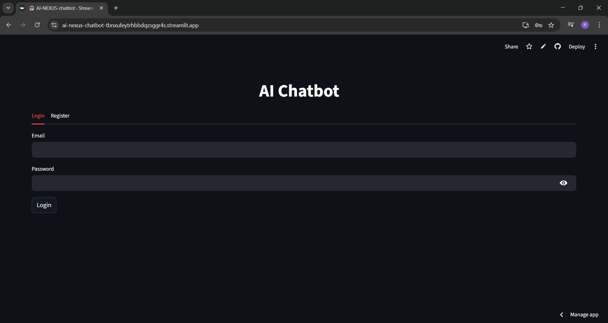
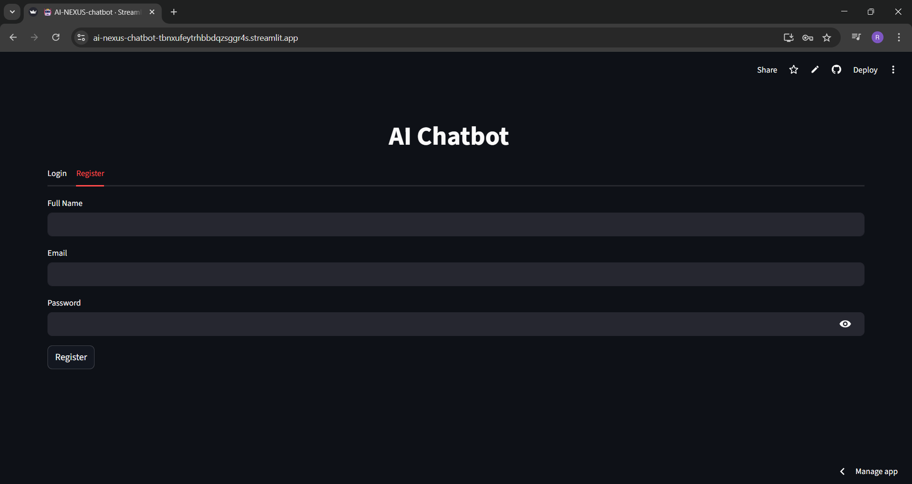
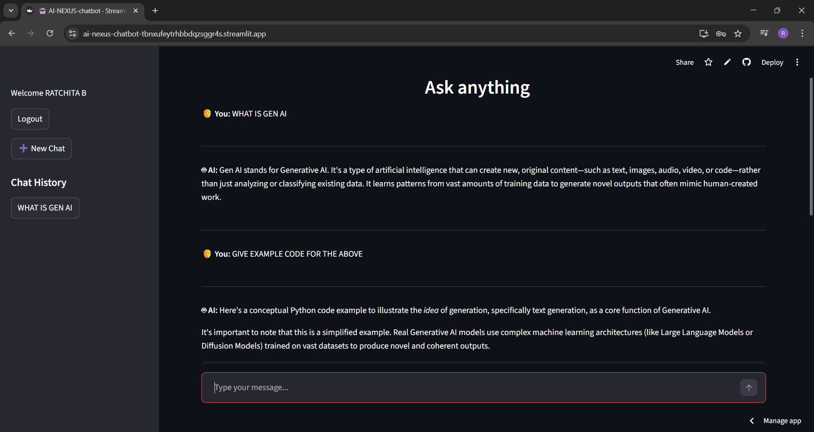

# 🤖 AI NEXUS – Generative AI Chatbot


---

## 🚀 Overview

**AI NEXUS** is a powerful **Generative AI chatbot platform** built using **Python, Streamlit, and Google Gemini API**.

It delivers a **ChatGPT-like experience** with intelligent conversation memory, multi-session chat handling, and real-time AI responses.

---

## ✨ Key Features

### 🔐 Authentication System

* Secure **Login & Registration**
* Session-based authentication
* No sensitive data leakage

### 🤖 AI Chatbot (Gemini 2.5 Flash)

* Powered by **Google Gemini LLM**
* Context-aware responses
* Prompt-engineered outputs

### 💬 Multi-Chat Sessions

* ChatGPT-style conversation threads
* Sidebar navigation for chats
* Click any chat → loads full conversation

### 🧠 Memory & Context Awareness

* Remembers previous messages
* Sends chat history as context to AI
* Improves response quality

### ⚡ Real-Time Chat UI

* Instant responses
* Auto-refresh using `st.rerun()`
* Smooth interactive experience

---

## 🧠 How It Works

1. User logs in securely
2. Enters a prompt
3. Previous chat context is attached
4. Gemini LLM processes the request
5. Response is generated
6. Chat is stored in session memory
7. Sidebar displays all chat sessions

---

## 🖥️ Live Demo

🔗 https://ai-nexus-chatbot-tbnxufeytrhbbdqzsggr4s.streamlit.app/

---

## 🛠️ Tech Stack

* **Frontend:** Streamlit
* **Backend:** Python
* **LLM:** Google Gemini API (gemini-2.5-flash)
* **State Management:** Streamlit Session State
* **Storage:** JSON (users) + Session Memory

---

## 📁 Project Structure

```
ai-llm-chatbot/
│
├── app.py
├── config.py
├── requirements.txt
├── .env
│
├── modules/
│   ├── auth.py
│   ├── chatbot.py
│   └── history.py
│
└── data/
    └── users.json
```

---

## ⚙️ Installation & Setup

### 1️⃣ Clone Repository

```bash
git clone https://github.com/22AD040/ai-nexus-chatbot.git
cd ai-llm-chatbot
```

### 2️⃣ Create Virtual Environment

```bash
python -m venv venv
venv\Scripts\activate
```

### 3️⃣ Install Dependencies

```bash
pip install -r requirements.txt
```

### 4️⃣ Add API Key

Create a `.env` file:

```env
GEMINI_API_KEY=your_api_key_here
```

---

## ▶️ Run the App

```bash
streamlit run app.py
```

---

## 🔐 Deployment (Streamlit Cloud)

1. Push your project to GitHub
2. Open **Streamlit Cloud**
3. Deploy your repository
4. Add secrets:

```toml
GEMINI_API_KEY = "your_api_key_here"
```

---

## 📸 Screenshots

### 🔐 Login Page


---

### 📝 Register Page


---

### 💬 Chat Interface


---

### 📂 Sidebar Chat Sessions
✔️ Click previous chats to reload conversation  
✔️ Multi-chat thread support (like ChatGPT)  
✔️ Real-time session switching

---

## 📌 Future Enhancements

* 📊 ML & Data Analyzer Integration
* 💾 Persistent Database Storage (SQLite/Firebase)
* 🌙 Dark Mode UI
* 📱 Mobile Responsive Design
* 🧠 Long-term Memory (RAG)

---

## 👩‍💻 Author

**Ratchita B**

---

## 📜 License

This project is licensed under the **MIT License**

---

## ⭐ Why This Project?

✔️ Real-world LLM application
✔️ Demonstrates authentication + AI integration
✔️ ChatGPT-like UI & UX
✔️ Clean modular architecture
✔️ Portfolio-ready project

---

## 🚀 Next Steps

* Add advanced UI (chat bubbles, animations)
* Integrate ML models
* Deploy with custom domain
* Add database persistence

---
